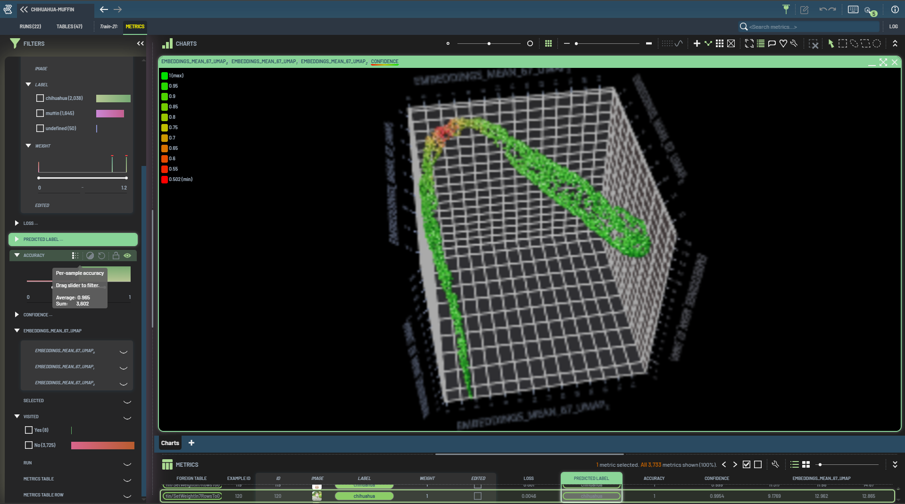

# Chihuahua vs Muffin - Data-Centric AI Hackathon

## Overview

This project was developed for a data-centric AI hackathon where the objective was to improve classifier performance by improving data quality, not model architecture.

- **Task:** Binary image classification (`chihuahua` vs `muffin`)
- **Model:** ResNet-18 trained from scratch (fixed architecture)
- **Rules:** No model architecture changes, no pretrained weights
- **Starting data:** 100 labeled images (50 chihuahuas, 50 muffins) + 3,579 unlabeled images
- **Workflow platform:** 3LC for embeddings, confidence analysis, and labeling operations

We reached the top accuracy through iterative labeling, correction, and sample-weight refinement.

## Data-Centric Methodology

### 1) Labeling low-confidence samples

We began with undefined samples at low confidence, since these are often hard or ambiguous examples.

- Used 3LC 3D embeddings + lasso to select clusters of similar samples
- Labeled in batches using Shift + Select

Results:

- **Train 1:** confidence `< 0.51` -> **83.8%**
- **Train 2:** continued confidence `< 0.51` -> **84.4%**

### 2) Expanding the uncertainty range

We expanded the threshold to include more near-boundary samples.

Results:

- **Train 3:** confidence `< 0.55` -> **85.4%**
- **Train 4:** confidence `< 0.60` -> **87.8%**

These examples were near the decision boundary and improved class separation.

### 3) Correcting high-confidence errors

We reviewed cases where the model was very confident but disagreed with labels.

Results:

- **Train 5:** reviewed confidence `> 0.80` with prediction != label  
  - Corrected wrong labels  
  - Set ambiguous samples to `undefined` (`weight = 0`)  
  - Validation accuracy: **89.2%**

This reduced label noise and improved dataset quality.

### 4) Labeling high-confidence undefined samples

We labeled highly confident undefined samples.

Results:

- **Train 6:** labeled confidence `> 0.95`  
  - Added around 350 images/class  
  - Validation accuracy stayed at **89.2%**

This suggested high-confidence samples were less informative than boundary samples.

### 5) Labeling decision-boundary samples

We focused on mid-confidence samples, which typically carry the most learning signal.

Results:

- **Train 7:** confidence `0.60-0.85` -> **91.2%**
- **Train 8:** confidence `0.50-0.70` -> **91.4%**
- **Train 9:** continued boundary labeling + corrections -> **91.6%**
- **Train 10:** confidence `0.50-0.80` -> **92.6%**

### 6) Hyperparameter experiments

We tested an alternative training setup.

Results:

- **Train 11:** `epochs = 15`, `learning_rate = 0.001` -> **91.1%**

This underperformed relative to our baseline settings.

### 7) Sample-weight adjustments

We increased weights for harder/uncertain samples so the model focused more on difficult cases.

Results:

- **Train 12:** misclassification `weight = 1.2` for confidence `< 0.60` -> **92.8%**
- **Train 16:** updated weighting for confidence `< 0.60` -> **93.4%**
- **Train 17:** updated weighting for confidence `< 0.65` -> **93.7%**
- **Train 18:** removed weighting nuance (`weights` only `0` or `1`) -> **93.3%**

### 8) Additional labeling for class balance

We continued targeted labeling to improve balance and coverage.

Results:
- **Train 13:** added more muffin labels -> **93.1%**
- **Train 14:** added more chihuahua labels -> **93.6%**
- **Train 15:** labeled both classes -> **93.3%**

### 9) Final weight strategy

Final gains came from weighting mid-confidence samples.

Results:

- **Train 19:** confidence `0.55-0.80` -> `weight = 1.2` -> **94.3%**
- **Train 20:** labeled more undefined samples -> **93.3%**
- **Train 21:** same weighting strategy -> **94.0% (Kaggle leaderboard)**

### Train 21 Embedding View (3LC Dashboard)

The final run (`Train 21`) embedding view from 3LC is shown below.

